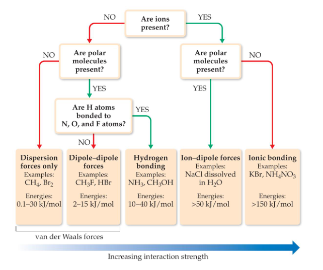

## Differences in the states of matter
Gas: assumes both bolume and shape of its container, expands to fill its container, is compressible, flows readily, diffusion with a gas occurs rapidly

Liquid: Assumes shape of portion of container it occupies, does not expand to fill its container, is virtually incompressible, flows readily, diffusions within a liquid occurs slowly

Solid: ratains own shape and volume, does not expand to fill container, is virtually incompressible, does not flow, diffusion within a solid occurs extremely slowly

## Inter molecular Forces
Many physical properties reflect intermolecular forces, like **boiling points**, **melting points**, **viscosity**, **surface tension**, and **capillary action**

weaker->stronger: dispersion forces, dipole-dipole forces, hydrogen bonding, ion-dipole forces

The first two types are also referred to collectively as van der Waals forces

## Dispersion Forces
The tendency of an electron cloud to distort is called its **polarizability**

+ number of electrons in an atom (more electrons, more dispersion force)
+ size of atom or molecule/molecular weight
+ shape of molecules with similar masses (more compact, less dispersion force)

If something is more difficult to polarize, it has a lower boiling point

## Dipole–Dipole Interactions
Polar molecules have a more positive and a more negative end–a dipole

For molecules of approximately equal mass and size, the more polar the molecule, the higher its boiling point

If two molecules are of comparable size and shape, dipole–dipole interactions will likely be the dominating force

If one molecule is much larger than another, dispersion forces will likely determine its physical properties

## Hydrogen Bonding

The dipole–dipole interactions experienced when H is bonded to N, O, or F are unusually strong

Hydrogen bonding arises in part from the high electronegativity of nitrogen, oxygen, and fluorine

## Ion–Dipole Interactions
Ion–dipole interactions are found in solutions of ions

The strength of these forces is what makes it possible for ionic substances to dissolve in polar solvents

## Viscosity
Resistance of a liquid to flow is called **viscosity**

Viscosity increases with stronger intermolecular forces and decreases with higher temperature

## Surface Tension

## Cohesion and Adhesion
Intermolecular forces that bind similar molecules to one another are called cohesive forces

Intermolecular forces that bind a substance to a surface are called adhesive forces

## Capillary Action
The rise of liquids up narrow tubes is called capillary action

Adhesive forces attract the liquid to the wall of the tube.

Cohesive forces attract the liquid to itself.

## Phase Changes
Phase changes: melting/freezing, vaporizing/condensing, subliming/depositing
