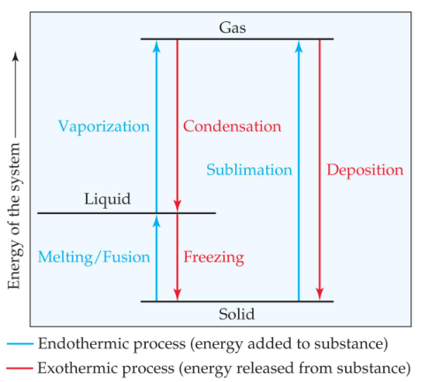
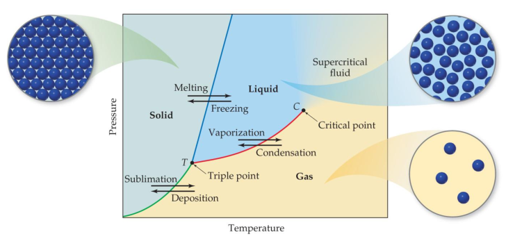

## Phase changes

The temperature of the substance does not rise during a phase change

The temperature beyond which a gas cannot be compressed is called its **critical temperature**. The pressure needed to compress the liquid at critical temperature is called **critical pressure**

The state beyond this temperature is called a **supercritical fluid**

## Vapor Pressure
The boiling point of a liquid is the temperature at which its vapor pressure equals atmospheric pressure

**The normal boiling** point is the temperature at which its vapor pressure is 760 torr

The natural log of the vapor pressure of a liquid is inversely proportional to its temperature

This relationship is quantified in the **Clausius–Clapeyron equation**

$$\ln P=\frac{-\triangle H_{vap}}{RT}+C$$

A **phase diagram** is a graph of pressure vs. temperature for a substance. It shows
+ melting, boiling, and sublimation points at different pressures.
+ the triple point (T) and critical point (C)

Unusual feature for water:

The slope of the solid-liquid line is negative. This means that as the pressure is increased, the melting point decreases.

Unusual features for carbon dioxide:

cannot exist in the liquid state at pressures below 5.11 atm (triple point)

## Solids
**Metallic solids** are held together by a “sea” of collectively shared electrons

**Ionic solids** are sets of cations and anions mutually attracted to one another.

**Covalent-network** solids are joined by an extensive network of covalent bonds

**Molecular solids** are discrete molecules held together by weak forces

**Polymers** and **Nanomaterials**

Solids with a regular repeating pattern of atoms are **crystalline**

## Lattice Points

Positions that define the overall structure of the crystalline compound are called **lattice points**

**Lattice vectors** connect the points and define the unit cell

**Primitive lattices** have atoms only in the lattice points

**Centered lattices** have atoms in another regular location, most commonly the body-center or the face-center

## Alloys
Alloys are materials that contain more than one element and have the characteristic properties of metals

**Substitutional alloys**: A second element takes the place of a metal atom

**Interstitial alloys**: A second element fills a space in the lattice of metal atoms

**Heterogeneous alloys**: components not dispersed uniformly