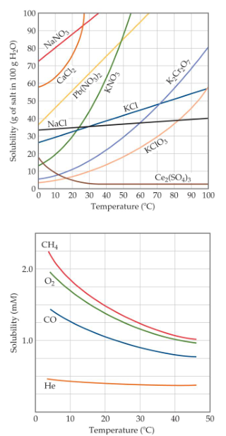

##  Solutions
**Solutions** are homogeneous mixtures of two or more pure substances

In a solution, the **solute** is dispersed uniformly throughout the **solvent**

Attractions inivolved when forming a solution:
1. solute-solute interactions must be overcome to disperse these paricles when making a solution
2. solvent-solvent interactions must be overcome to make room for the solute
3. solvent-solute interactions occur as the particles mix

The solution-making process and **crystallization** are opposing processes

**Solubility** is the maximum amount of solute that can dissolve in a given amount of solvent at a given temperature

## Factors That Affect Solubility
1. Solute–solvent Interactions
2. Pressure
3. Temperature

## Solute-Solvent Interactions
Like dissolves like

The stronger the solute–solvent interaction, the greater the solubility of a solute in that solvent

Polar organic molecules dissolve in water better than nonpolar organic molecules

## Liquid/Liquid Solubility
Liquids that mix in all proportions are miscible

Liquids that do not mix in one another are immiscible

## Henry's Law
The solubility of a gas is proportional to the partial pressure of the gas above the solution.
$$S_g=kP_g$$

## Temperature Effects
For most solids, as temperature increases, solubility increases. However, clearly this is not always true—some increase greatly, some remain relatively constant, and others decrease

For all gases, as temperature increases, solubility decreases. Cold rivers have higher oxygen content than warm rivers

