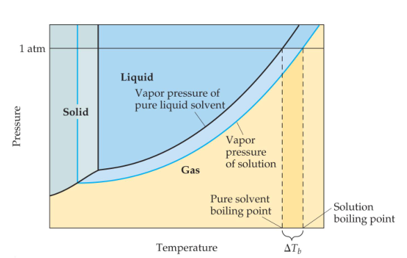

## Colligative Properties
Colligative properties depend only on the quantity, not on the identity of the solute particles

+ Vapor-pressure lowering
+ Boiling-point elecation
+ Freezing-point depression
+ Osmotic pressure

### Raoult’s Law
The vapor pressure of a volatile solvent over the solution is the product of the mole fraction of the solvent times the vapor pressure of the pure solvent
$$P_{solution}=X_{solvent}P^{\circ}_{solvent}$$
### Boiling-Point Elevation and Freezing-Point Depression
The change in temperature is directly proportional to molality (using the van’t Hoff factor)

$$\Delta T_{b}=T_{b}(solution)-T_{b}(solvent)=iK_{b}m$$
$$\Delta T_{f}=T_{f}(solution)-T_{f}(solvent)=-iK_{f}m$$

### The van’t Hoff Factor(i)
Theoretically, we get 2 particles when NaCl dissociates. So, i = 2

### Osmosis
The net movement of solvent molecules from solution of low to high concentration across a semipermeable membrane is osmosis. The applied pressure to stop it is osmotic pressure

Osmotic pressure is a colligative property
$$\prod=i(\frac{n}{V})RT=iMRT$$
If two solutions separated by a semipermeable membrane have the same osmotic pressure, no osmosis will occur

Colloidal suspensions can scatter rays of light. (Solutions do not.)
This phenomenon is known as the **Tyndall effect**

## Chemical Kinetics
Factors affect reaction rates
+ physical state of the reactants
+ reactant concentrations
+ reaction temperature
+ presence of a catalyst 