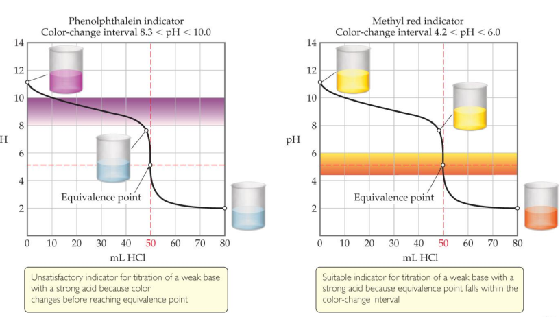

## The common-ion effect
Whenever a weak electrolyte and a strong electrolyte containing a common ion are together in solution, the weak electrolyte ionizes less than it would if it were alone in solution

## Buffers
Solutions of a weak conjugate acid–base pair that resist drastic changes in pH are called buffers

These solutions contain relatively high concentrations (10–3 M or more) of both the acid and base. Their concentrations are approximately equal

Ways to Make a Buffer

Mix a weak acid and a salt of its conjugate base or a weak base and a salt of its conjugate acid

Mix a weak acid and a salt of its conjugate base or a weak base and a salt of its conjugate acid

## Buffer Capacity
The amount of acid or base the buffer can neutralize before the pH begins to change to an appreciable degree

Using the Henderson–Hasselbalch equation, pH will be the same for a conjugate acid–base pair of 1 M each or 0.1 M each; however, the buffer which is 1 M can neutralize more acid or base before the pH changes

### pH Range
The range of pH values over which a buffer system works effectively

The range of pH values over which a buffer system works effectively

$$p\mathrm{H}=p\mathrm{K_{a}}+\log\frac{[A^-]}{[HA]}$$

## Titration
In this technique, an acid (or base) solution of known concentration is slowly added to a base (or acid) solution of unknown concentration

A pH meter or indicators are used to determine when the solution has reached the equivalence point: The amount of acid equals that of base

## Indicator
