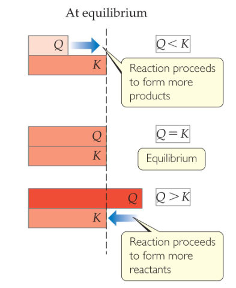

## Chemical Equilibrium
**Chemical equilibrium** occurs when a reaction and its reverse reaction proceed at the same rate. In the figure above, equilibrium is finally reached in the third picture

As a system approaches equilibrium, both the forward and reverse reactions are still occurring

At equilibrium, the forward and reverse reactions are proceeding at the same rate

At equilibrium

$$Rate_f=Rate_r$$

Consider the generalized reaction

$$aA+bB=dD+eE$$

The equilibrium expression for this reaction would be

$$K_{c}=\frac{\left[D\right]^d\left[E\right]^e}{\left[A\right]^a\left[B\right]^b}$$

Also, since pressure is proportional to concentration for gases in a closed system, the equilibrium expression can also be written

$$K_{p}=\frac{(P_D)^d(P_E)^e}{(P_A)^a(P_B)^b}$$

Equilibrium can be reached from either direction

When two consecutive equilibria occur, the equations can be added to give a single equilibrium

The equilibrium constant of the new reaction is the product of the two constants

## Homogeneous vs. Heterogeneous
Homogeneous equilibria occur when all reactants and products are in the same phase

Heterogeneous equilibria occur when something in the equilibrium is in a different phase

## Comparing Q and K
If $Q < K$, nature will make the reaction proceed to products

If $Q = K$, the reaction is in equilibrium

If $Q > K$, nature will make the reaction proceed to reactants

## LeChâtelier’s Principle

If a system at equilibrium is disturbed by a change in temperature, pressure, or the concentration of one of the components, the system will shift its equilibrium position so as to counteract the effect of the disturbance