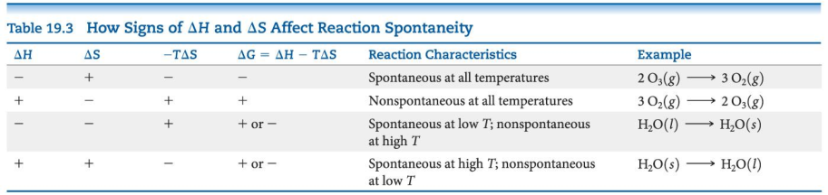

## Gibbs Free Energy
$$\Delta G=\Delta H-T\Delta$$

If $\Delta G$ is negative, the forward reaction is spontaneous

If $\Delta G$ is 0, the system is at equilibrium

If $\Delta G$ is positive, the reaction is spontaneous in the reverse direction

## Standard Free Energy Changes
Analogous to standard enthalpies of formation are standard free energies of formation, $\Delta G_f^{\circ}$

Gibbs Free energy is a state function

- **its change depends only on initial and final states**

Since reactions are spontaneous if ΔG < 0, the sign of enthalpy and entropy and the magnitude of the temperature matters to spontaneity

Under any conditions, standard or nonstandard, the free energy change can be found this way

$$\Delta G=\Delta G^{\circ}+RT\ln Q$$