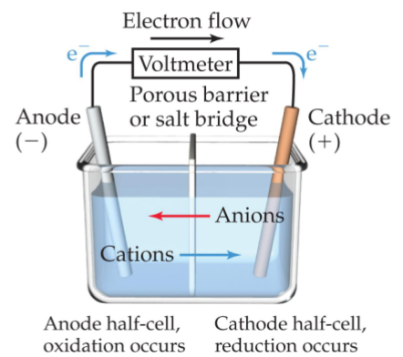

## Voltaic Cells
In spontaneous redox reactions, electrons are transferred and energy is released

The oxidation occurs at the anode

The reduction occurs at the cathode

### Electromotive Force

The potential difference between the anode and cathode in a cell is called the electromotive force (emf)

It is also called the cell potential and is designated $E_{cell}$

The cell potential at standard conditions can be found through this equation

By definition as the standard, the reduction potential for hydrogen is 0 V

$$E^{\circ}_{cell}=E^{\circ}_{red}(cathode)-E^{\circ}_{red}(anode)$$

Because cell potential is based on the potential energy per unit of charge, it is an intensive property

## Oxidizing and Reducing Agents
The more positive the value of $E^{\circ}_{red}$, the greater the tendency for reduction under standard conditions

The strongest oxidizers have the most positive reduction potentials

The strongest reducers have the most negative reduction potentials

Spontaneous redox reactions produce a positive cell potential, or emf

$$E^{\circ}=E^{\circ}_{red}(reduction)-E^{\circ}_{red}(oxidation)$$

$$\Delta G=-nFE$$

$$E^{\circ}=\frac{RT}{nF}\ln K$$

A cell could be created that has the same substance at both electrodes, called a concentration cell

## Electrolysis

Nonspontaneous reactions can occur in electrochemistry IF outside electricity (an external source of current) is used to drive the reaction

Use of electrical energy to create chemical reactions is called electrolysis