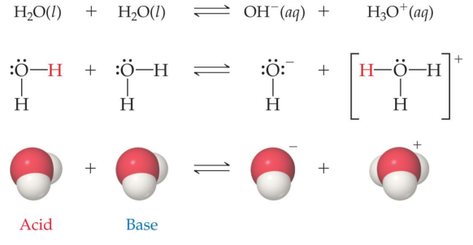

## Catalysts
Catalysts increase the rate of both the forward and reverse reactions

Equilibrium is achieved faster, but the equilibrium composition remains unaltered

Activation energy is lowered, allowing equilibrium to be established at lower temperatures

## Acid
An acid is a proton donor

A base is a proton acceptor

Reactions between acids and bases always yield their conjugate bases and acids

Water can act as a Brønsted–Lowry base and accept a proton (H+) from an acid, as on the previous slide

Acids above the line with H2O as a base are strong acids; their conjugate bases do not act as acids in water

Bases below the line with H2O as an acid are strong bases; their conjugate acids do not act as acids in water

In every acid–base reaction, equilibrium favors transfer of the proton from the stronger acid to the stronger base to form the weaker acid and the weaker base

## Autoionization of Water
Water is amphoteric

In pure water, a few molecules act as bases and a few act as acids

## pH
pH is a method of reporting hydrogen ion concentration

$$pH=-\log\left[H^+\right]$$

Neutral pH is 7.00

Acidic pH is below 7.00

Basic pH is above 7.00

How Do We Measure pH?

Indicators, including litmus paper, are used for less accurate measurements; an indicator is one color in its acid form and another color in its basic form.

pH meters are used for accurate measurement of pH; electrodes indicate small changes in voltage to detect pH

## Weak Acids
For a weak acid, the equation for its dissociation is
$$HA(aq) + H_2O(l) ⇌ H_3O^+(aq) + A^–(aq)$$

Since it is an equilibrium, there is an equilibrium constant related to it, called the acid-dissociation constant, Ka:$Ka = [H3O+][A–] / [HA]$