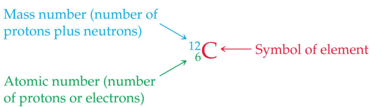
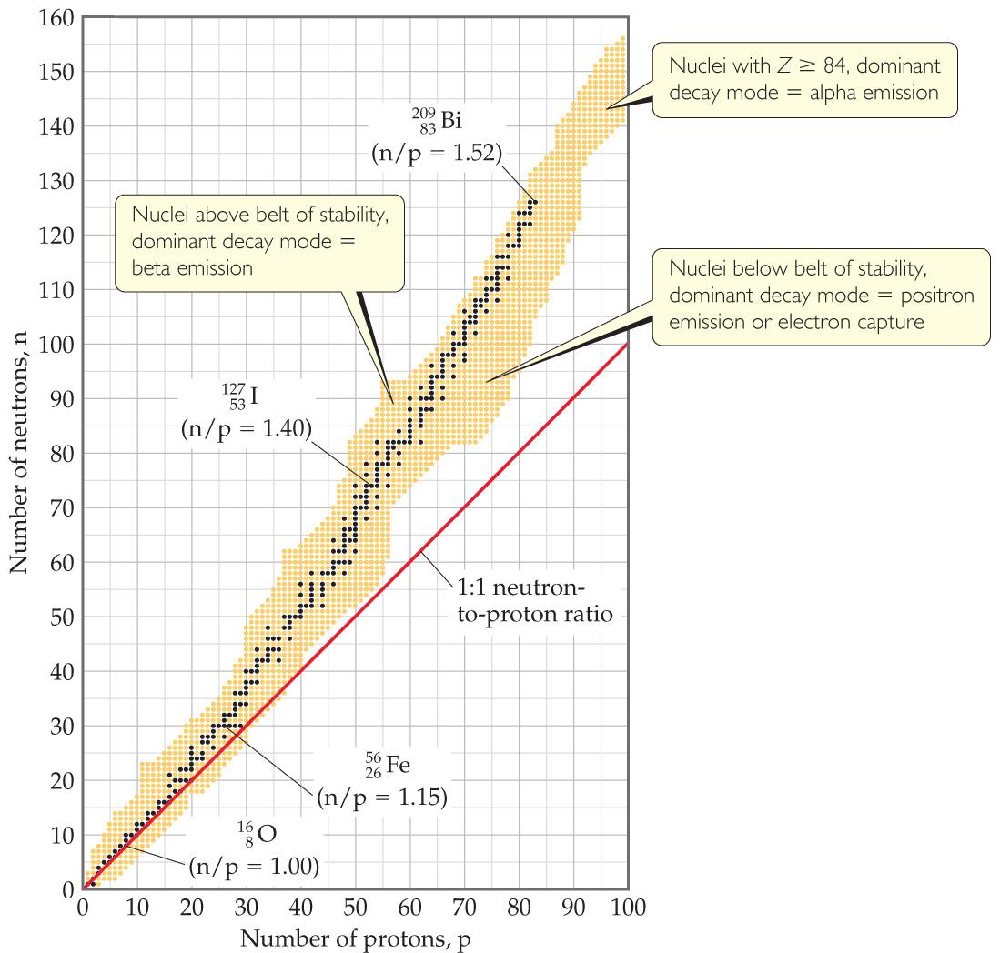

## Nucleus

The nucleus is composed of the two nucleons, protons and neutrons

## Raiation
types of radioactive decay:
+ alpha decay
+ beta decay
+ gamma emission
+ positron emisssion
+ electron capture

Alpha decay is the loss of an α-particle (He-4 nucleus, two protons and two neutrons):

$$^{238}_{92}U\rightarrow^{234}_{90}Th+^{4}_{2}He$$

Beta decay is the loss of a β-particle (a high-speed electron emitted by the nucleus):

$$^{131}_{53}I\rightarrow^{131}_{54}Xe+^{0}_{-1}e$$

Gamma emission is the loss of a γ-ray, which is high-energy radiation that almost always accompanies the loss of a nuclear particle

Some nuclei decay by emitting a positron, a particle that has the same mass as, but an opposite charge to, that of an electron

$$^{11}_{6}$C\rightarrow^{11}_{5}B+{0}_{1}e$

An electron from the surrounding electron cloud is absorbed into the nucleus during electron capture

$$^{81}_{37}R+^{0}_{1}e\rightarrow^{81}_{36}Kr$$

## Nuclear Stability
Any atom with more than one proton (anything but H) will have repulsions between the protons in the nucleus

For smaller nuclei (Z ≤ 20), stable nuclei have a neutron-to-proton ratio close to 1:1

As nuclei get larger, it takes a larger number of neutrons to stabilize the nucleus

Nuclei above this belt have too many neutrons, so they tend to decay by emitting beta particles

Nuclei below the belt have too many protons, so they tend to become more stable by positron emission or electron capture

Magic numbers of 2, 8, 20, 28, 50, or 82 protons or 2, 8, 20, 28, 50, 82, or 126 neutrons result in more stable nuclides

Nuclei with an even number of protons and neutrons tend to be more stable than those with odd numbers

## Kinetics of Radioactive Decay
Radioactive decay is a first-order process

The kinetics of such a process obey this
equation:

$$\ln\frac{N_t}{N_0}=-kt$$

The half-life of such a process is $\frac{0.693}{k}=t_{\frac{1}{2}}$

## Energy in Nuclear Reactions
There is a tremendous amount of energy stored in nuclei

Einstein’s famous equation, $E = mc^2$, relates directly to the calculation of this energy

The masses of nuclei are always less than those of the individual parts.This mass difference is called the **mass defect**

The energy needed to separate a nucleus into its
nucleons is called the nuclear **binding energy**

Heavy nuclei gain stability and give off energy when they split into two smaller nuclei. This is fission

Lighter nuclei emit great amounts of energy by being combined in fusion