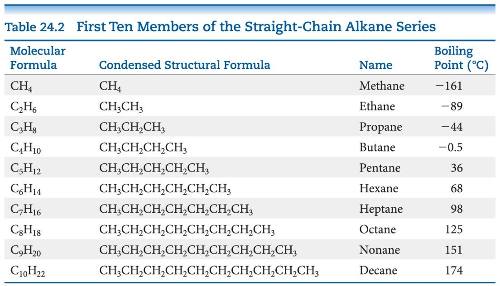

## Organic and Biological Chemistry
Groups of atoms that determine how an organic molecule reacts are called **functional groups**

Most prevalent bonds are C—C and C—H, which are nonpolar; solubility in water is low for many organic compounds

Organic molecules, such as glucose, that have polar groups are soluble in polar solvents

## hydrocarbons
Four basic types of hydrocarbons:
+ Alkanes
+ Alkenes
+ Alkynes
+ Aromatic hydrocabons

## Alkanes

Alkanes known as saturated hydrocarbons

The only van der Waals force is the London dispersion force

Boiling point increases with the length of the chain

## How to name a compound
1. Find the longest continuous chain of C atoms, and use this as the base name
2. Number the chainfrom the end nearest the first substituent encountered
3. Name each substituent
4. Begin the nname with the number on the C atom to which each substituent is bonded.
5. When tow or more substituent are present, list them alpabetically

Cycloalkanes: 3  or 4 C ring is not very stable

Naming: add cyclo- as a prefix to alkane name.