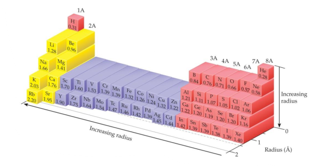
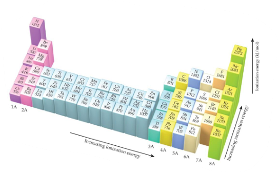

## Atomic Number
The number of protons was considered the basis for the periodic property of elements

## Effective Nuclear Charge

The effective nuclear charge, $Z_{eff}$, is found this way: $Z_{eff}=Z-S$
where Z is the atomic number and S is a screening constant, usually close to the number of inner electrons

$Z_{eff}$ of valence e increases from the left to the right of the periodic table

$Z_{eff}$ of valence e increases slightly as we go down a column – more diffuse core electron cloud is less able to screen the valence e form the nuclear charge

## The size of an atom

**Bonding aotmic radius**

+ Clear invers coreelation between ENC $Z_{eff}$ and atomic radius in a period
+ Radius increases significantly down a group

**Ionic size**

depends on the nulear charge, the number fo electrons, the orbitals in which electrons reside

*$O^{2-} is larger than $O$*
the increase in e repulsions that accompanies addition of an e causes the electron cloud to expand

*S^{2-} is larger than $O^{2-}$*
for particles with like charges size increases going down a family

*S^{2-} is larger than $K^+$*
the two ioons ar isoelectronic and $K^+$ has the larger $Z$ and $Z_{eff}$.

## Ionization Energy
The ionization energy is the minimum energy required to remove an electron from the ground state of a gaseous atom or ion

The first ionization energy ($I_1$) is that energy required to remove the first electron

The second ionization energy ($I_2$) is that energy required to remove the second electron, etc

the higher the ionization energy, the more difficult it is to remove an electron

+ $I_1$ generally increases across a period

+ $I_1$ generally decreases down a group

+ Group 2A to 3A – drop in $I_1$ when a $p$ orbital e’s is removed

+ Group 5A to 6A – drop in $I_1$ when a p orbital e’s is removed from a doubly occupied orbit

