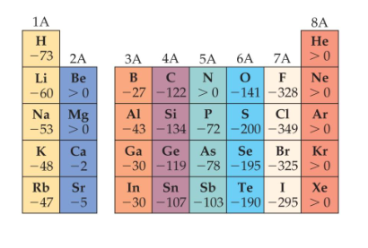

## Electron Affinity

typically *exothermic*

**General Trend in Electron Affinity**

1. not much change in a group

2. increase in a period

## Periodic Table

From right to left, the metallic character increase

Metals tend to form cations

Nonmetals tend to form anions

## Metal
+ Shiny luster

+ Conduct heat and electricity

+ Malleable and ductile

+ Solids at room temperature (except mercury)

+ Low ionization energies/form cations easily

+ Compounds formed between metals and nonmetals tend to be ionic

+ Metal oxides tend to ve basic

## Nonmetals

+ Solid, liquid, or gas (depends on element)

+ Solids are dull, brittle, poor conductors

+ Large negative electronegativity/form anions readily

+ Substances containing only nonmetals are usually molecular compounds

+ Most nonmetal oxides are acidic

## Metalloids(semi-metals)

+ Metalloids have some characteristics of metals and some of nonmetals

+ Several metalloids are electrical semiconductors (computer chips)

## Group Trends

+ 1A: the alkali metals

+ 2A: the alkaline earth metals

+ 6A: the oxygen group

+ 7A: the halogens

+ 8A: the noble gases