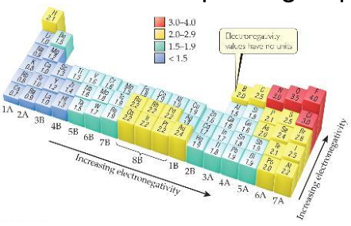

## Chemical Bonds
+ **Ionic**: Electrostatic attraction between (oppositely charged) ions
+ **Covalent**: Sharing of electrons
+ **Metallic**: Metal atoms bonded to several other atoms via “sea” of electrons

## The Octet Rule
Stable ions or molecules generally have 8 valence e’s in the first two rows or some in the third row

Exceptions:H, He, B, P and beyond

endothermic: 吸热的

exothermic: 放热的

## Lattice Energy
That huge, exothermic transition is the reverse of the lattice energy

The energy associated with electrostatic interactions is governed by Coulomb’s law:

$$E_{el}=k\frac{Q_1Q_2}{d}$$

where $k$ is a constant, $q$ is the charge of the particle, $d$ is the distance between centers of the particles

Lattice energy increases with:

+ increasing charge on the ions

+ decreasing size of ions

## Polar Covalent Bonds
+ The electrons in a covalent bond are not always shared equally

+ When two atoms share electrons unequally, a polar covalent bond results

## Electronegativity
Electronegativity is the ability of an atom in a molecule to attract electrons to itself

On the periodic table, electronegativity generally increases as:
> from left to right across a period
> from the bottom to the top of a group

Electrons tend to spend more time around the more electronegative atom. The result is a partial negative charge (not a complete transfer of charge). It is represented by $\delta–$

The greater the difference in electronegativity, the more polar is the bond

### Dipoles(偶极子)
When two equal, but opposite, charges are separated by a distance, a dipole forms

A dipole moment, $\mu$, produced by two equal but opposite charges separated by a distance, $r$, is calculated: $\mu=Qr$