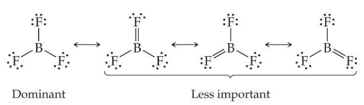

## Exceptions to the Octet Rule

+ ions or molecules with an odd number of electrons, e.g. $NO$

+ ions or molecules with less than an octet

+ ions or molecules with more than eight valence electrons

Elements in the second period before carbon can make stable compounds with fewer than eight electrons e.g. $BF_3$

When an element is in period 3 or below in the periodic table (e.g., periods 3, 4, 5, etc.), it can use d-orbitals to make more than four bonds e.g. $PF_5$

## Binary covalent compounds

Made from only 2 different non-metal elements

name of the element farther to the left of the periodic table is written first (except oxygen)

the name of the second element has an -ide ending

e.g. $N_2O_4$ Carbondioxide

## Covalent Bond Strength
The strength of a bond is measured by determining how much energy is required to break the bond

This is called the **bond enthalpy**

As the number of bonds between two atoms increases, the bond length decreases

## Molecular Shapes
The best arrangement of a given number of electron domains is the one that minimizes the repulsions among them

Double and triple bonds have larger electron domains than single bonds

### Linear Electron Domain
If there are only two atoms in the molecule, the molecule will be linear no matter what the electron domain is

### Trigonal Planar Elecrtron Domain
Two molecular geometries:
+ trigonal planar, if all electron domains are bonding
+ bent, if one of the domains is a nonbonding pair

### Tetrahedral Electron Domain
Three molecular geometries:
+ tetrahedral, if all are bonding pairs
+ trigonal pyramidal, if one is a nonbonding pair
+ bent, if there are two nonbonding pairs

### Trigonal Bipyramidal Electron Domain
There are two distinct positions in this geometry:
+ Axial
+ Equtorial

Lone pairs occupy equatorial positions

four distinct molecular geometries:
+ Trigonal bipyramidal 
+ Seesaw
+ T-shaped
+ Linear

### Octahedral Electron Domain
three molecular geometries:
+ Ocatahedral
+ Square pyramidal
+ Square planar