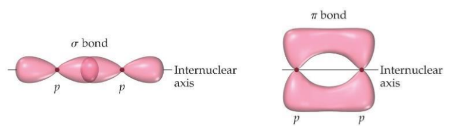
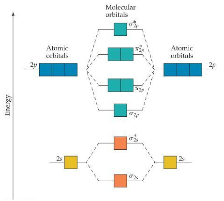

## Polar Molecule

## Valence-Bond Theory
In Valence-Bond Theory, electrons of two atoms begin to occupy the same space

The sharing of space between two electrons of opposite spin results in a covalent bond

## Hybrid Orbitals
**Hybrid orbitals** form by “mixing” of atomic orbitals to create new orbitals of equal energy, called degenerate orbitals

two degenerate orbitals would align themselves $180^{\circ}$ from each other

Valence-Bond model would use d orbitals to make more than four bonds

## Type of bonds
Two types of bonds:
+ Sigma($\sigma$) bond
+ Pi($\pi$) bond

Sigma bonds are characterized by:
+ head to head overlap
+ cylindrical symmetry of electron density about the internuclear axis

Pi bonds are characterized by:
+ side-to-side overlap
+ electron density above and below the internuclear axis

Single bonds are always $\sigma$-bonds

Bonding electrons ($\sigma$ or $\pi$) that are specifically shared between two atoms are called localized electrons

## Molecular Orbital (MO) Theory
Whenever two atomic orbitals overlap, two molecular orbitals are formed: **one bonding**, **one antibonding**

Bond order = $\frac{1}{2}$(# of bonding electrons – # of antibonding electrons)

There are $\sigma$ and $\sigma^*$ orbitals from s and p atomic orbitals

There are $\pi$ and $\pi^*$ orbitals from p atomic orbitals

$\sigma$ MO is more stable than $\pi$ MO 

$\sigma^*$ MO is less stable than $\pi^*$ MO 

Energy:

[分子轨道简明读本](https://zhuanlan.zhihu.com/p/66231852)