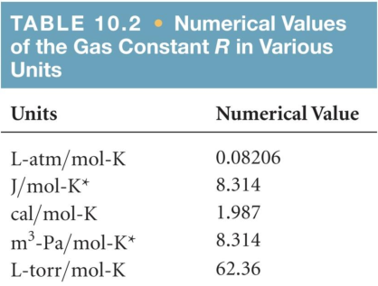

## Gases
Physical properties of gases are all similar

Composed mainly of nonmetallic elements with simple formulas and low molar masses

Unlike liquids and solids, gases
+ expand to fill their containers
+ are highly compressible
+ have extremely low densities

1.00 atm = 760 torr = 760 mm Hg = 101.325 kPa

### Boyle's law
The volume (V) of a fixed quantity of gas at constant temperature (T) is inversely proportional to the pressure (P)

This means, if we compare two conditions:
$$P_1V_1=P_2V_2$$

### Charles's law
The volume (V) of a fixed amount of gas at constant pressure is directly proportional to its absolute temperature (T)

$$V=kT$$

$$V_1K_1=V_2K_2$$

### Avogadro's law
The volume (V) of a gas at constant temperature and pressure is directly proportional to the number of moles (n) of the gas

$$\frac{V_1}{n_1}=\frac{V_2}{n_2}$$

At STP, one mole of gas occupies 22.4 L

## Ideal-Gas Equation
$$PV=nRT$$

## Density of Gases
If we divide both sides of the ideal-gas equation by $V$ and by $RT$, we get
$$n/V = P/RT$$
Also: $moles \times molecular mass = mass$
$$n \times M = m$$
If we multiply both sides by $M$, we get
$$m/V = MP/RT$$
and $m/V$ is density, $d$; the result is:
$$d = MP/RT$$

## Dalton’s Law of Partial Pressures
The total pressure of a mixture of gases equals the sum of the pressures that each would exert if it were present alone

$$P_{total}=\sum_{i=1}^nP_i$$

## Pressure and Mole Fraction

$$P_1=(\frac{n_1}{n_t})P_t=X_1P_t$$

If a gas has a low mass, its speed will be greater than for a heavier molecule

### Graham’s Law Describes Diffusion & Effusion

Graham’s Law relates the molar mass of two gases to their rate of speed of travel

The “lighter” gas always has a faster rate of speed
$$\frac{r_1}{r_2}=\sqrt{\frac{M_2}{M_1}}$$

## Corrections for Nonideal Behavior
The ideal-gas equation can be adjusted to take these deviations from ideal behavior into account

The corrected ideal-gas equation is known as the **van der Waals equation**

$$(P+\frac{n^2a}{V^2})(V-nb)=nRT$$