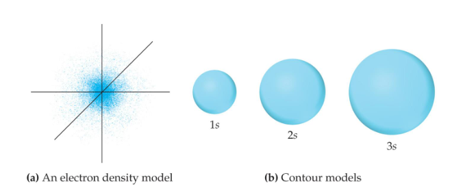
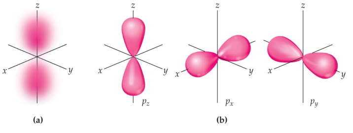
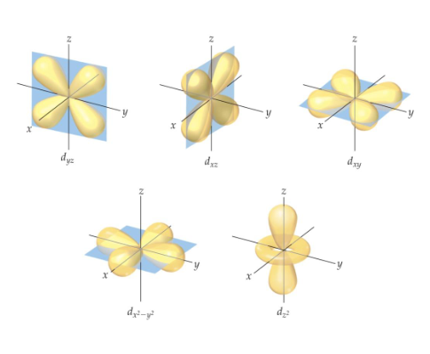
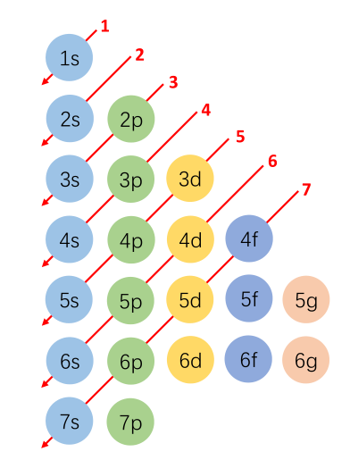
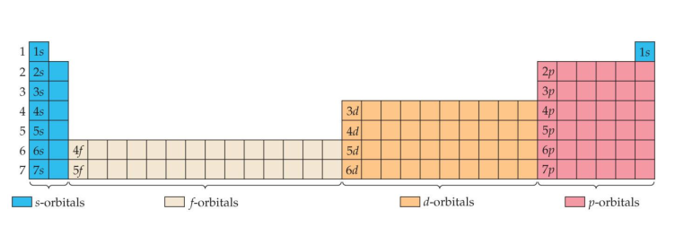

## Angular Momentum Quantum Number($m_l$)

1. This quantum number defines the shape of the orbital

2. Allowed values of l are integers ranging from 0 to n − 1

3. We use letter designations to communicate the different values of l and, therefore, the shapes and types of orbitals

| value of l | 0 | 1 | 2 | 3 |
| :----: | :----: | :----: | :----: | :----: | 
| Letter used | s | p | d | f |

## Magnetic Quantum Number ($m_l$)
1. The magnetic quantum number describes the three-dimensional orientation of the orbital

2. Allowed values of ml are integers ranging from −l to l

3. Therefore, on any given energy level, there can be up to 1 s orbital, 3 p orbitals, 5 d orbitals, 7 f orbitals, and so forth.

~~NO f orbital~~

## Pauli Exclusion Principle
No two electrons in the same atom can have exactly the same energy

## Electron Configuration
electron configuration $4p^5$

4 is the energy level

p is the type of the orbital

5 is the number of electrons

## Hunt's Rule
For degenerate orbitals, the lowest energy is attained when the number of electrons with the same spin is maximized

Some irregularities occur when there are enough electrons to half-fill s and d orbitals on a given row

## Order for REMOVING Electrons
Highest n with highest l electron comes out first

Filling up of orbitals is dependent on orbital energy

lobe 叶,一叶

degenerate orbital 简并轨道