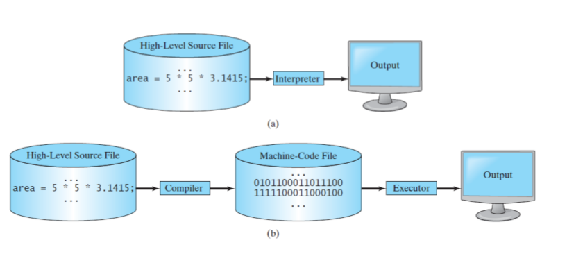
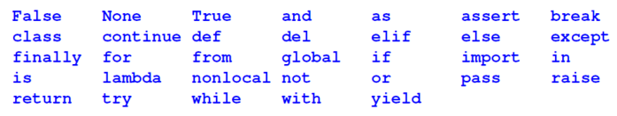

## The units of information
+ Bit: a binary digit which takes either 0 or 1

+ Bit is the smallest information unit in computer programming

+ Byte: 1 byte = 8 bits,every English character is represented by 1 byte

## Python basics


### Interpreter and compiler

### reserved words



### program flows
+ sequential flow: flows from step by step
```python
x=2
print(x)
x=x*10
print(x)
```
+ conditional flow: branches
```python
x=5
if x<10:
    print('smaller')
if x>20:
    print('larger')
print('finished')
```

+ repeated flow: 
```python
n=5
while n>0:
    print(n)
    n=n-1
print('finish')
```
### Rules for defining variables in python

Must start with a letter or underscore_

Can only contain letters, nuumbers and underscore

Case sensitive

### Assignment statement

We assign a value to a variable using the assignment operator (=)

An assignment statement consists of an expression on the right hand side, and a variable to store the result