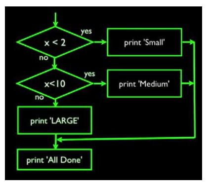

## Conditional Flow
Program
```python
x=5
if x<10
    print('smaller')
if x>2
    print('larger')
>>>smaller
larger
```

### comparison operators

| | |
| --- | --- |
| x<y | is x less than y? |
| x<=y | is x less than or equal to y? |
| x==y | is x equal to y? |
| x!=y | is x not equal to y? |

first calculate the numerical expressions

### Boolean

True: 

`int(True)=1`

`str(True)='True'`

False:

`int(False)=0`

`str(False)='False'`

bool()

`bool(x)` is true excpet for `''` and `0`

Nested Decisions:

```python
if A :
    if B :
        if C :
            ...
```

two way decisions:

```python
x=10
if x>5:
    print('larger')
else: 
    print('smaller')
```

multi-way decision:
```python
x=10
if x>2:
    print('larger')
elif x>15:
    print('smaller')
else: #or no else
    print('medium')
```



## Logical Operators

Python has three logical operators: not, and, or

```python
not True
>>>False

False and True
>>>False

True or False
>>>True
```

*pls write a progrram to instruct users to input two numbers, one is for the month, one is for the day, the print'The day is Feb19th', if the day is invalid, print'The day is invalid'*
```python
a=[Januaray,March,May,July,August,October,December]
b=[April,June,September,November]
c=[Feburary]
month=input('pls type month:')
date=input('psl type date')
if month in a:
    if 4<=date<=31:
        print('The day is '+month+date+'th')
    elif date=1:
        print('The day is '+month+date+'st')
    elif date=2:
        print('The day is '+month+date+'nd')
    elif date=3:
        print('The day is '+month+date+'rd')
    else:
        print('The day is invalid')
elif month in b:
    if 4<=date<=30:
        print('The day is '+month+date+'th')
    elif date=1:
        print('The day is '+month+date+'st')
    elif date=2:
        print('The day is '+month+date+'nd')
    elif date=3:
        print('The day is '+month+date+'rd')
    else:
        print('The day is invalid')
elif month in c:
        if 4<=date<=28:
        print('The day is '+month+date+'th')
    elif date=1:
        print('The day is '+month+date+'st')
    elif date=2:
        print('The day is '+month+date+'nd')
    elif date=3:
        print('The day is '+month+date+'rd')
    else:
        print('The day is invalid')
else:
    print('The day is invalid')
```