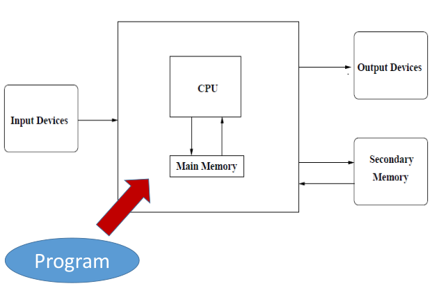
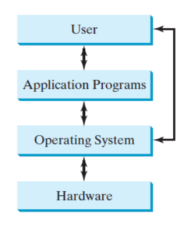

## Topic
+ do practice
+ writer than a typer 
+ Understand what is programming
+ Think as a programmer
+ Reading is important
## What is Code? Software? Program?
A sequence of instructions

Computers take the instructions and execute them

It is a little piece of our intelligence in the computer

Intelligence which is re-usable

## Computer Hardware 


+ Central processing unit (CPU): execute your program. Similar to human
brain, very fast but not that smart

+ Central processing unit (CPU): execute your program. Similar to human
brain, very fast but not that smart

+ Output device: output information to users or other devices

+ Main memory: store data, fast and temporary storage

+ Secondary memory: slower but large size, permanent storage

## Operating System
Interface to the users


## positional notation
+ Decimal number system

+ Binary number system

+ Hexadecimal number system

+ Octal number system

Why we can convert the number by this way? Easy to prove.


Convert system to another
```python
n=57
b=''
while True
    b=Str(n%2)+b
    n=int(n/2)
    if n==0:
        break
print(b)
```