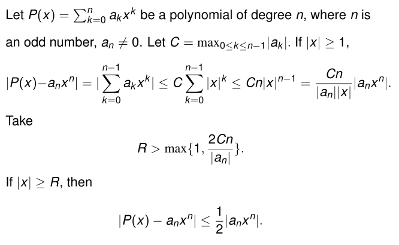
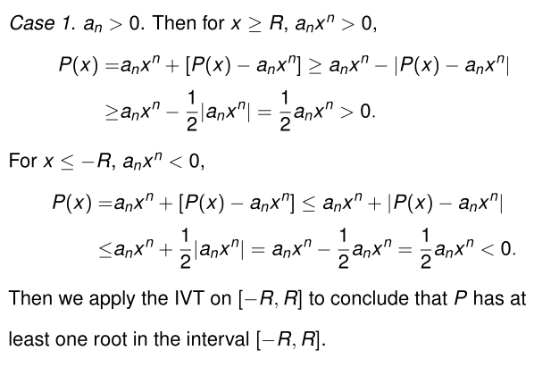
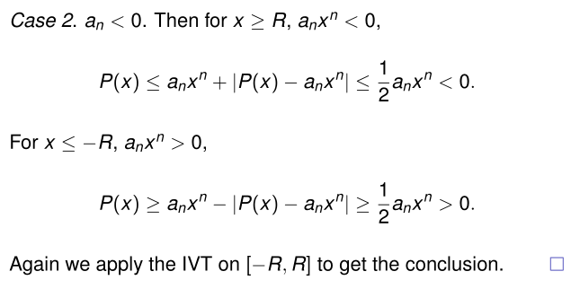

## Continuity

Any polynomial of odd degree has at least one real root.

## Limit involving infinity

Assume $f(x)$ is defined on $(M_0, \infty)$. We say that $f(x)$ has the limit $L$ as $x$ approaches infinity and write

$$\lim_{x\to \infty}f(x)=L$$

for every number $\epsilon > 0$, there exists a corresponding
number $M \geq M_0$ such that

$$|f(x)-L|<\epsilon\text{ whenever }x>M$$

All the Limit Laws are true when we replace $\lim_{x\to c}$ by $\lim_{x\to\infty}$ or $\lim_{x\to -\infty}$.

## Infinite limit
We say that $f(x)$ approaches negative infinity as $x$
approaches $c$, and write

$$\lim_{x\to c}f(x)=\infty$$

if for every negative real number $B$ there exists a corresponding $\delta > 0$ such that

$$x \in I \backslash \{c\}, f(x) > B \text{ whenever } 0 < |x − c| < \delta.$$

Similarly we define one-sided infinite limits