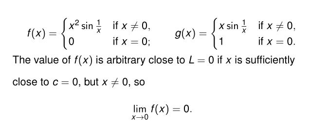

## Limit

### informal definition

Suppose that $f(x)$ is defined on an open interval $c$, except $c$.

If $f(x)$ is arbitrarily close to $L$, for all $x$ sufficiently close to $c$ other than $c$ itself.

We say that $f$ approaches the limit $L$ as $x$ approaches $c$

we denote $\lim\limits_{x\to c}f(x)=L$

Read it: the limit of $f(x)$ as $x$ approaches $c$.

The value of $f$ at $c$ is irrelevant to the limit.

Limits of polynomials

$P(x)=\sum\limits_{k=0}^na_kx_k$

$\lim\limits_P(x)=P(c)$

$\lim\limits_{x\to c}\frac{P(x)}{Q(x)}=\frac{P(c)}{Q(c)}$

The sandwich theorem

Suppose that $g(x)\leq f(x)\leq h(x)$ for all $x$ in some open interval containing $c$,except $x=c$, suppose also that $\lim_{x\to c}g(x)=\lim_{x\to c}h(x)=L$

Then $\lim_{x\to c}f(x)=L$ 

~~保号性懒得码了~~

只保 $\leq$ or $\geq$ 不保 $<>$

### The definition of limit
Defined on the delete center intervals:

$\lim\limits_{x \to c}f(x)=L\Leftrightarrow \forall \epsilon>0\exists \delta>0(\left| x-c \right| <\delta\Rightarrow\left| f(x)-L  \right| <\epsilon)$

or use $0<\left| x-c \right| <\delta$

Proof: $\lim_{x\to c} $ implies that, for $x$ close to $c$, $\left|g(x)-L\right|<\epsilon\Leftrightarrow L-\epsilon<g(x)<L+\epsilon$ 

Similarly, for $x$ close to $c$, $\epsilon\Leftrightarrow L-\epsilon < h(x) < L+ \epsilon $, so we have $\epsilon\Leftrightarrow L-\epsilon<g(x)\leq f(x)\leq h(x)<L+\epsilon$

Given arbitrary $\epsilon > 0$, we need to find $\delta > 0 $such that $\left|f(x)-L\right|<\epsilon$, $0<\left|x-c\right|\delta$ .

It's easy to finish proof by yourself :)