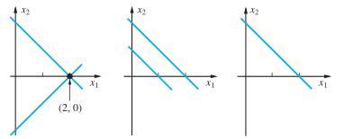

## What is Linear

Geomatrically, linear means 'straight' or 'flat'

Linear also means **NO PRODUCT**

## Linear equations

A linear equation in n unknowns is an equation of the form

$a_1x_1+a_2x_2+...+a_nx_n=b$

$x+3y-2z=0$--->linear equation

$xy+5yz=0$--->nonliear equation

e.g.

$\begin{aligned}&x_1+x_2=2\\&x_1-x_2=2\end{aligned}$ has unique solution

$\begin{aligned}&x_1+x_2=2\\&x_1+x_2=1\end{aligned}$ has no solution

$\begin{aligned}&x_1+x_2=2\\&-x_1-x_2=-2\end{aligned}$ has infinite solution

the equations:

$\begin{aligned}&a_{11}x_1+a_{12}x_2=b_1\\&a_{21}x_1+a_{22}x_2=b_2\end{aligned}$

can be  represented graphically as a line in the plane.

In linear equations:

$\begin{aligned}&a_{11}x_1+a_{12}x_2+...+a_{1n}x_n=b_1\\&a_{21}x_1+a_{22}x_2+...+a_{2n}x_n=b_2\\ &\vdots \\&a_{m1}x_1+a_{m2}x_2+...+a_{mn}x_n=b_m\end{aligned}$

$m>n$:**overdetermined linear system**

$m<n$:**underdetermined linear system**

Two systems of equations involving the same variables are said to be **equivalent** if they have the same solution set.

## Basic elementary operations(*important*)

>1. Interchange the order in which two equations of a system

>2. One equation of a system is multiplied through by a nonzero real number

>3. A multiple of one equation is added to another equation

## Matrixs
A $m\times n$ matrix is a rectangle array of number with m rows and n columns

$A=\left[\begin{array}{cc}3&1\\2&5\end{array}\right]=\left[\begin{array}{cc}a_1,a_2\end{array}\right]=\left[\begin{array}{c}b_1\\b_2\end{array}\right]$

$a_1,a_2$ are called the **column vector**,$b_1,b_2$ are called the **row vector**

**Coeffient Matrix**:

$A=\left[\begin{array}{cccc}a_{11}&a_{12}&\cdots&a_{1n}\\a_{21}&a_{22}&\cdots&a_{2n}\\\vdots\\a_{m1}&a_{m2}&\cdots&a_{mn}\end{array}\right]$

**Augmented Matrix**:

$\left[\begin{array}{cccc|c}a_{11}&a_{12}&\cdots&a_{1n}&b_1\\a_{21}&a_{22}&\cdots&a_{2n}&b_2\\\vdots&&&&\vdots\\a_{m1}&a_{m2}&\cdots&a_{mn}&b_m\end{array}\right]$

$X=\left[\begin{array}{c}x_1\\x_2\\\vdots\\x_m\end{array}\right]$

$B=\left[\begin{array}{c}b_1\\b_2\\\vdots\\b_m\end{array}\right]$

To solve the equation, we need to solve the equation $AX=B$